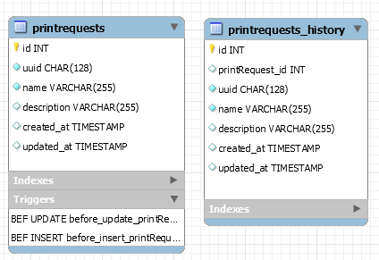

# Backend Database server
Based on [this blog post](https://blog.dbi-services.com/build-api-backend-server-with-nodejs-and-postgresql/) by Furkan Suv - September 2020

---
## Prerequisites

 - [**Mysql workbench community**](https://dev.mysql.com/downloads/workbench/) 
 - [**Mysql Server community**](https://dev.mysql.com/downloads/mysql/)
   
## Creating Local database
1. Open Mysql workbench
2. Add a connection with settings:
   - **Port** : 3306
   - **host** : 127.0.0.1
   - **passwd**: changeme
3. Test de connection
4. Open the connection 
5. File->Open SQL script->[ibus_test_script.sql](ibus_test_script.sql) 
6. Run the script

That's it! The test database should now be ready to go.
You can play with it, insert and update for testing purposes.

**This is just a database made to allow the testing of the whole pipeline. It will be changed in the future**

## IBUStest Structure

---
### TODO
 - Add real database
 - add a script to generate lots of fake data
 - add tests scripts to ensure the triggers work 